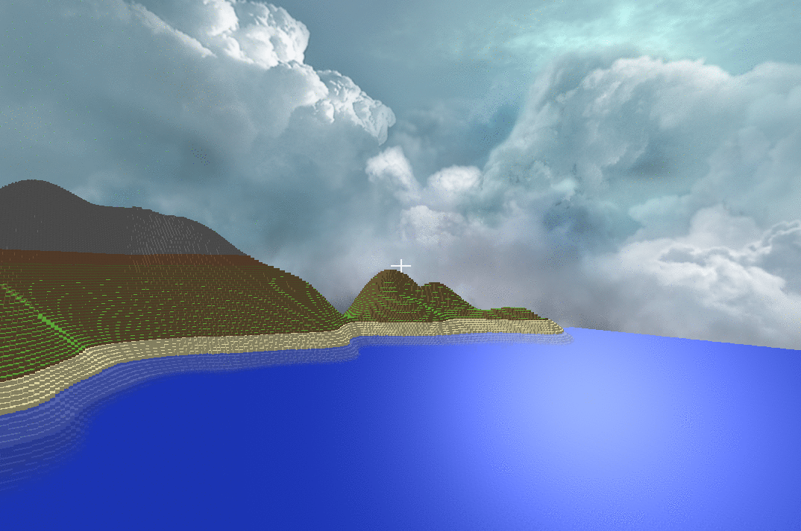
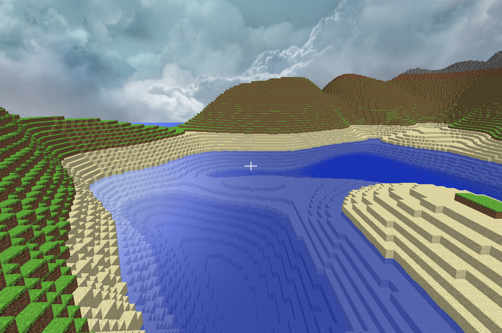
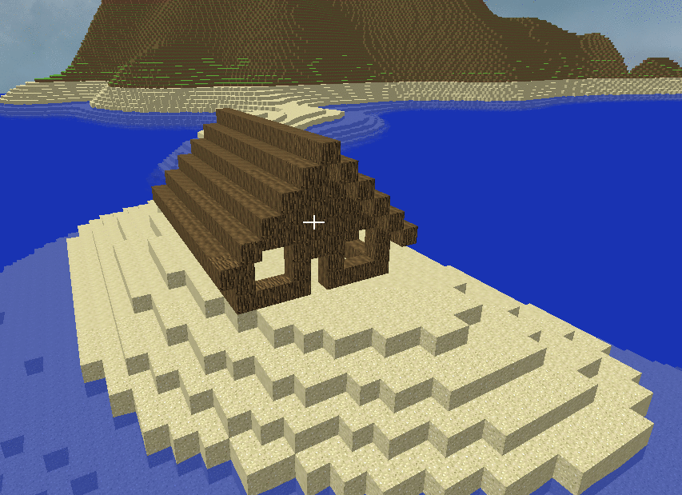
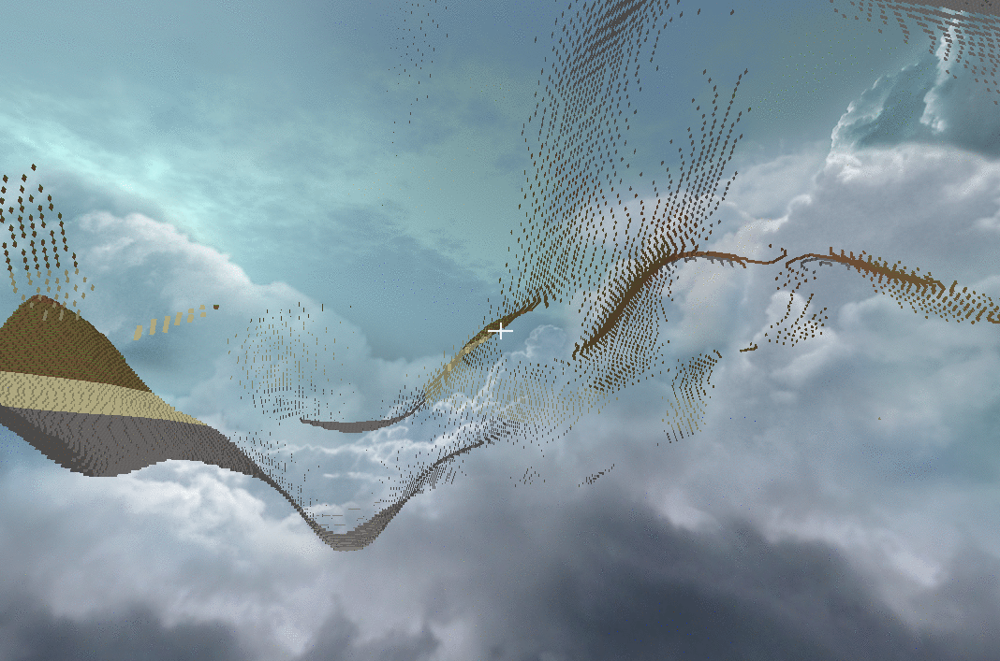

# VoxelGame
My approach on a basic Minecraft clone.\
As of now the most effort went into world generation and loading.

The chunk system is using a 3D grid which allows almost infinite terrain in every direction.\
The chunks are 32x32x32 voxels in size and are generated two each frame.
![World generation][gif2]

Voxels can also be deleted and placed. Voxel textures are from the original [Minecraft](https://www.minecraft.net) game.
![Building][gif3]

I gave the water some animations and reflections just for fun.
![Water details][gif1]

## Features
- World generation based on [open simplex noise](https://en.wikipedia.org/wiki/OpenSimplex_noise)
- Voxels can be destroyed and placed
- Water reflections and animations
- Multi pass rendering (for water transparency)
- Data compression of chunk mesh VBO's - documented in [vertex_data_schematic.txt](https://github.com/Raffa139/VoxelGame/blob/master/vertex_data_schematic.txt)

## Roadmap
- Text rendering
- Collisions
- Loading world around player
- Inventory
- World generation overhaul
- World loading overhaul

## More screenshots

    
    
    
    

[gif1]: images/water.gif
[gif2]: images/world_gen.gif
[gif3]: images/building.gif